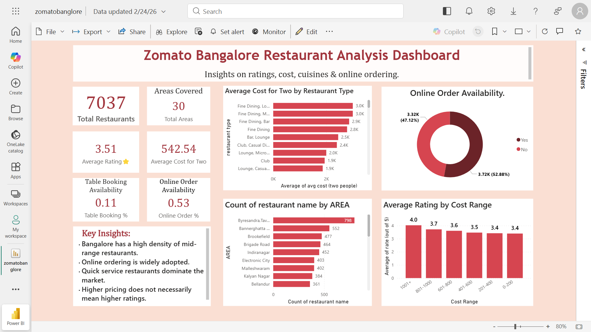

# 🍽 Zomato Bangalore Restaurant Analysis
## 📂 Repository Structure

| File Name | Description |
|-----------|-------------|
| [zomato_dataset.csv](zomato_data.csv) | Raw dataset used for analysis |
| [zomato_eda.ipynb](zomato_eda.ipynb) | Data cleaning & exploratory data analysis |
| [zomato_dashboard.pbix](zomatobanglore.pbix) | Interactive Power BI dashboard |
| [dashboard_preview.png](Zomato_banglore_dashboard.png) | Dashboard screenshot |
## 📌 Project Overview
This project performs end-to-end data analysis on the Zomato Bangalore dataset to extract business insights around pricing, ratings, and online ordering behavior.

---

## 📊 Dataset Details
- 7,037 Restaurants  
- 30 Locations  
- Food-tech industry data  

---

## 🔎 Exploratory Data Analysis (Python)
- Missing value treatment  
- Rating cleaning & formatting  
- Cost distribution analysis  
- Online order behavior study  

---

## 📈 Power BI Dashboard Features
- Executive KPI Overview  
- Area-wise restaurant distribution  
- Cost vs Rating analysis  
- Online ordering insights  

---

## 🛠 Tools Used
- Python (Pandas, Matplotlib, Seaborn)
- Power BI
- DAX

---

## 📷 Dashboard Preview

